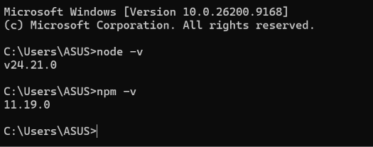
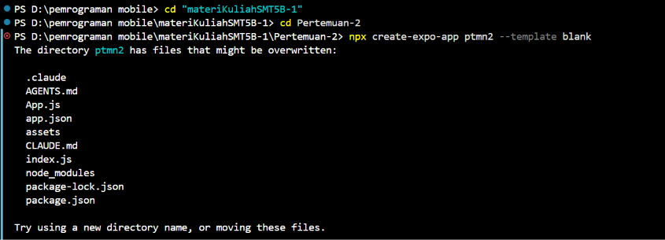
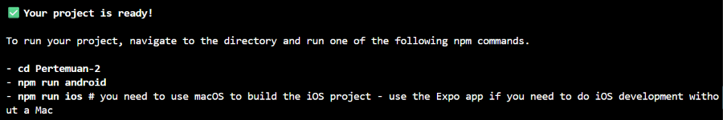

# Praktikum Menyiapkan Lingkungan Pengembangan dan Memulai Pemrograman Mobile (React Native) #

## Tujuan Pembelajaran ##
Mahasiswa mampu :
1. Menyiapkan Lingkungan Pengembangan dan Memulai Pemrograman mobile (React Native)
2. Membuat aplikasi mobile dengan React Native
3. Menyelesaikan Tugas CV sederhana dengan React Native

## Materi dan Laporan Praktikum ##
1. Menyiapkan Lingkungan Pengembangan dan Memulai Pemrograman mobile (React Native)
 - Memastikan instalasi Git bash
  - cek Instalasi Git bash (git --version)
  - bukti Verifikasi
 
 - Memastikan Node.JS dan NPM
   - Download dan Install Node.JS di https://nodejs.org/en/download/
   - Konvirmasi Node.JS dan NPM (node -v, npm -v)
 

2. Membuat aplikasi / Projek baru dengan React Native Framework Expo Go
 - Buka dan baca dokumentasi resmi link https://docs.expo.dev/
 - Buka dan baca dokumentasi resmi link https://reactnative.dev/docs/getting-started
 - memulai membuat projek baru
 - open terminal change directory ke Pertemuan-2
 - masukan perintah (npx create-expo-app ptmn2 --template blank)
 - bukti verifikasi
 
 
 
 - Running Projek
  - cd ke ptmn2
  - npx expo start
  - Install Expo go di android atau IOS
  - bisa juga menggunakan Web emulator di Laptop/PC
  - setelah berhentikan (ctrl + c)
  - Install (npx expo install react-dom react-native-web)
  - npx expo start --web
  - konfirmasi keberhasilan

  
 4. Tugas Praktikum
  - Membuat aplikasi CV sederhana dengan React Native
  - Nama Lengkap
  - NIM
  - Asal Sekolah
  - Cita-cita
  - Rencana Menggapai cita-cita
  - konfirmasi keberhasilan
  
