# laporan praktikum 3 : core components dan styling #

### 📝 langkah 1 : import library & components ###
```
1. buka file App.js yang ada di folder proyek ptmn2
2. import library dan component yang diperlukan
3. konfirmasi bukti
```
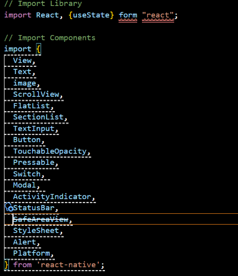

### 📝 Langkah 2 : Membuat Array Objek ###
```
1. buat objek array bernama    PROFILE untuk wadah data profile
2. masukan data yang diperlukan
3. konfirmasi bukti
```
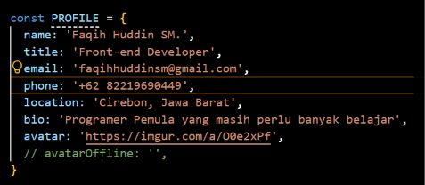

```
DATA SKILLS (array of objects) // → Akan ditampilkan dengan FlatList
 ```
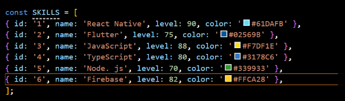

```
DATA RIWAYAT (sections) // → Akan ditampilkan dengan SectionList 
 ```
 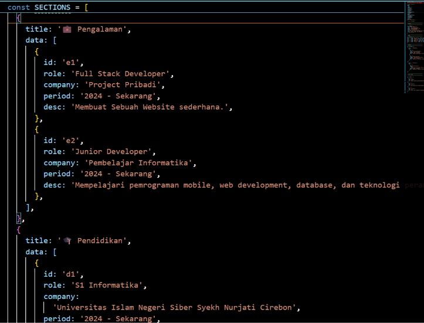
 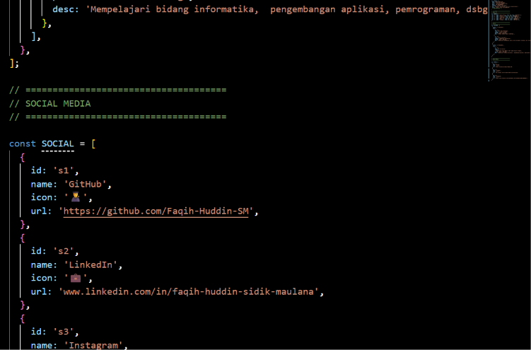
 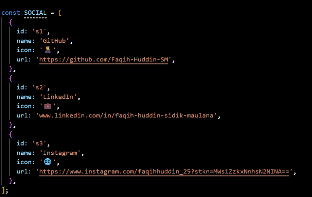

[!NOTE] Mengapa data di luar komponen?
Data yang tidak berubah (statis) tidak perlu masuk ke dalam fungsi komponen agar tidak di-recreate setiap render.

 ### 📝 LANGKAH 3 — Sub-Components (SkillCard & TimelineCard) ###

 **Konsep:** Komponen kecil yang bertugas merender satu item list. Ini adalah praktik **component reuse**.
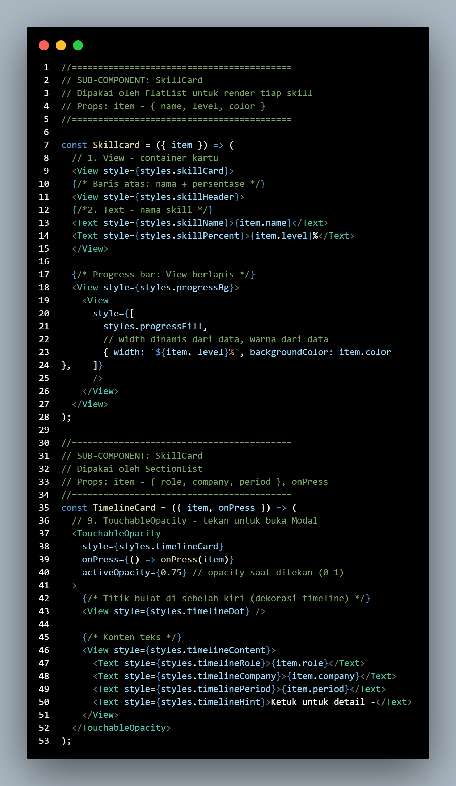

### 📝 LANGKAH 4 — State Management dengan useState  ###
**Konsep:** useState menyimpan data yang bisa berubah. Setiap perubahan state akan men-trigger re-render komponen.
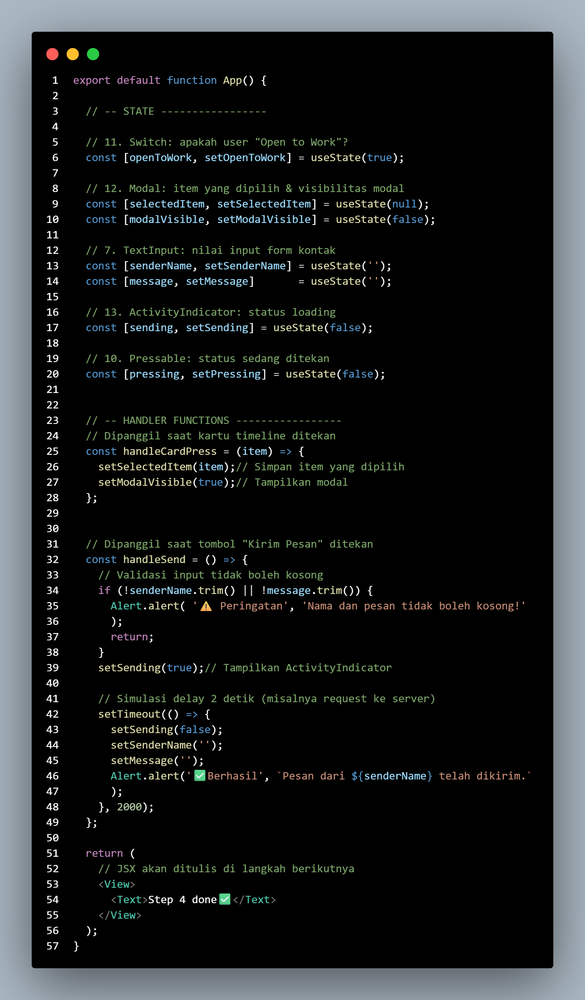
✅ Checkpoint: Aplikasi masih menampilkan teks, tidak ada error.

### 📝 LANGKAH 5 — SafeAreaView, StatusBar & Header ###
**Konsep:**
    - SafeAreaView → memastikan konten tidak tertutup notch (takik kamera) atau home indicator
    - StatusBar → mengatur tampilan bar di bagian atas perangkat
    - View + Switch → membangun header bar
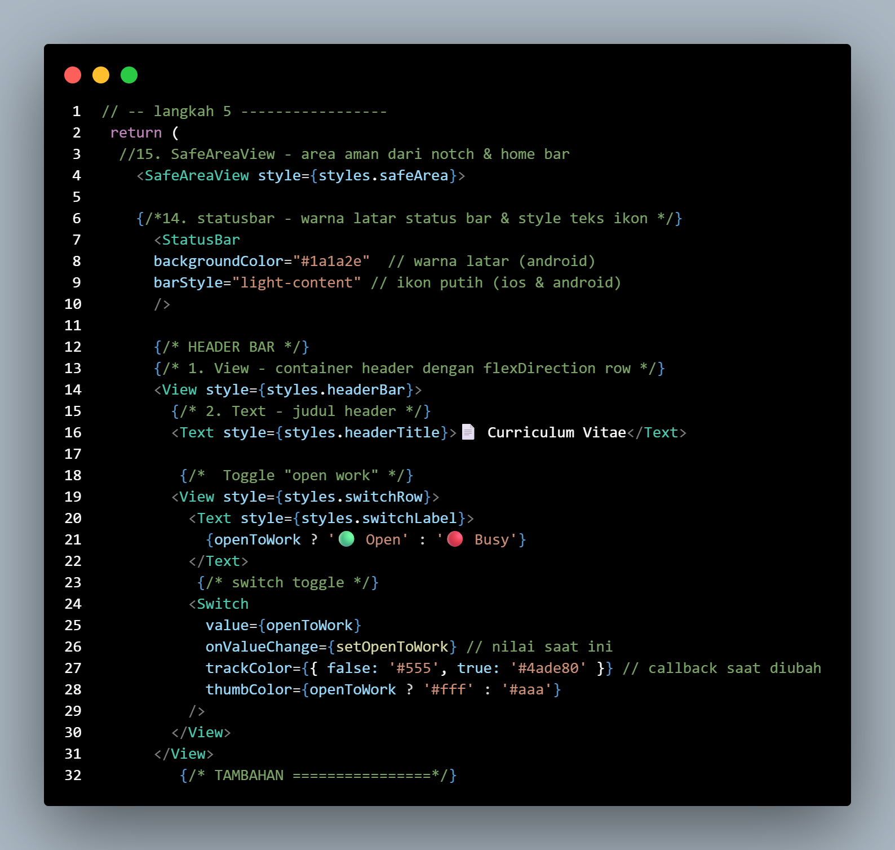

[!TIP] flexDirection: 'row' membuat anak View tersusun horizontal (kiri ke kanan).
Default di React Native adalah column (atas ke bawah).

✅ **Checkpoint:** Header bar berwarna gelap dengan teks putih dan switch terlihat.


### 📝 LANGKAH 6 — ScrollView & Profil Section (View, Text, img/image) ###
**Konsep:**

1. ScrollView → membungkus konten panjang agar bisa di-scroll
2. img/image → menampilkan gambar dari URL (source={{ uri: '...' }})
3. Text → bisa di-styling dengan style prop seperti CSS
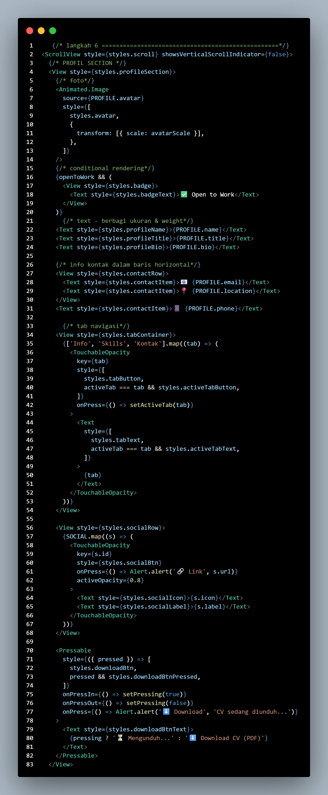

### 📝 LANGKAH 7 — FlatList (Daftar Skills) ###
**Konsep:** FlatList dioptimalkan untuk menampilkan daftar panjang — hanya item yang terlihat di layar yang di-render (lazy rendering / windowing).
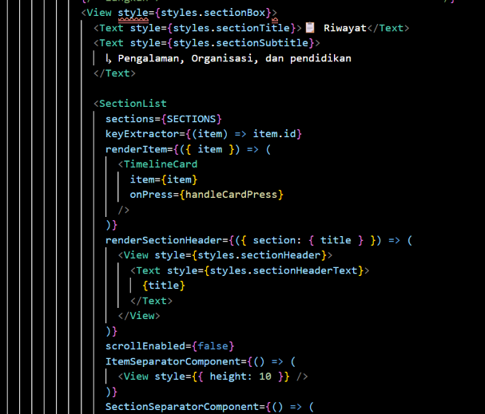
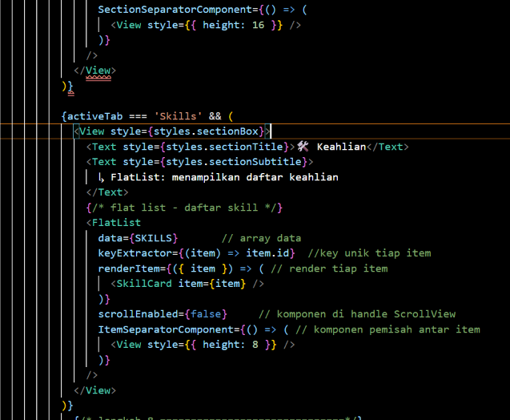

### 📝 LANGKAH 8 — SectionList (Pengalaman & Pendidikan) ###
**Konsep:** SectionList seperti FlatList tetapi bisa mengelompokkan data berdasarkan section/kategori. Membutuhkan prop sections (bukan data) yang berisi array objek { title, data }.
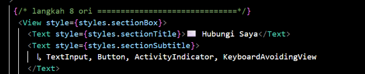

### 📝 LANGKAH 9 — TextInput, Button & ActivityIndicator
**Konsep:**

TextInput → input teks. value + onChangeText = controlled component
Button → tombol paling sederhana di React Native
ActivityIndicator → spinner loading
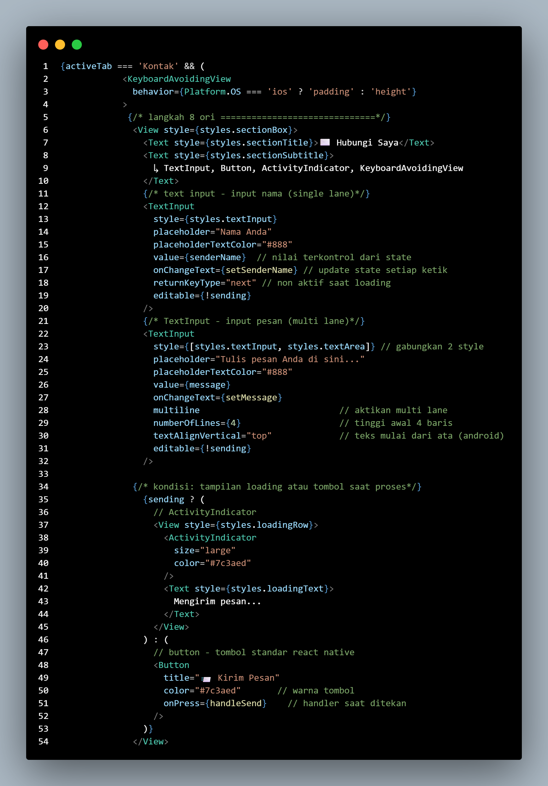

[!TIP] Controlled vs Uncontrolled Component:

1. Controlled: value={state} + onChangeText={setState} → nilai input selalu sesuai state
2. Uncontrolled: hanya pakai ref → tidak direkomendasikan di React
✅ **Checkpoint:** Form input nama & pesan berfungsi. Tekan "Kirim Pesan" → loading 2 detik → Alert sukses

### 📝 LANGKAH 10 — Modal (Popup Detail)
Konsep: Modal menampilkan konten di atas (overlay) tampilan saat ini. Dikendalikan dengan prop visible.

Tambahkan setelah penutup </ScrollView> dan sebelum </SafeAreaView>:
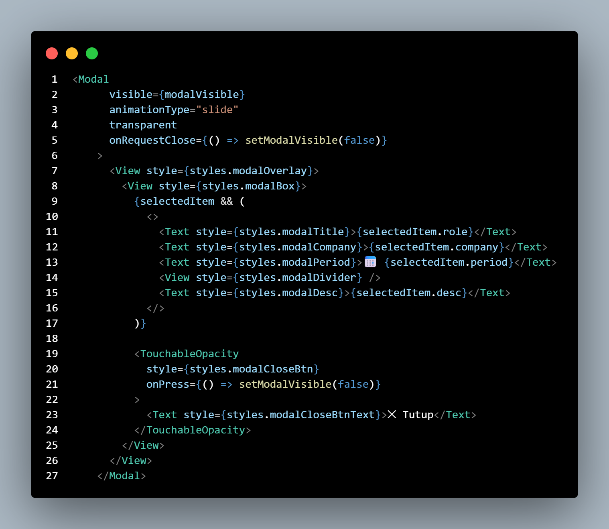

### 📝 LANGKAH 11 — StyleSheet (Styling Terpusat)
**Konsep:** StyleSheet.create() adalah cara resmi styling di React Native. Mirip CSS tetapi menggunakan JavaScript object dengan properti camelCase.

Tambahkan kode berikut di bawah fungsi App() (paling bawah file):
```
PALET WARNA
```
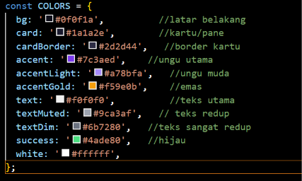


## Bukti Hasil Akhir ##
