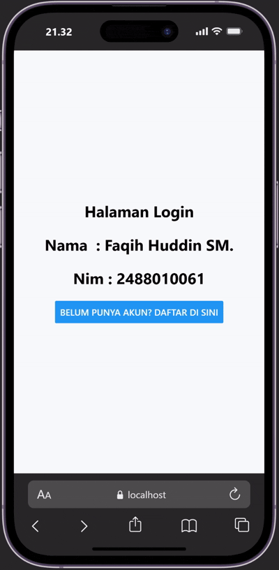
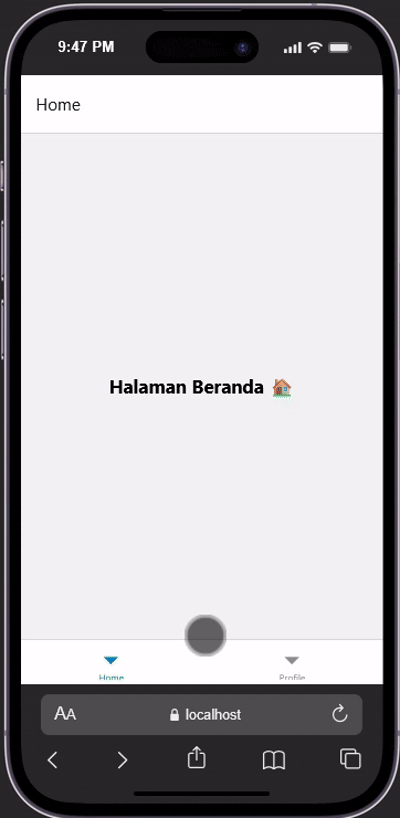
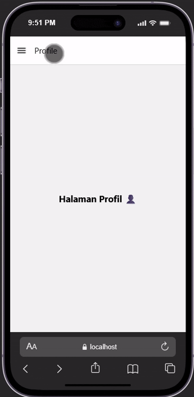

# Praktikum 4: react native navigation #

## Tujuan Pembelajaran ##
mahasiswa diharapkan mampu:
 1. Merancang dan menerapkan navigai antar layar (screen) pada aplikasi react native.
 2. menggunakan library dan menerapkan react navigation (stack navigator, tab navigator, drawer navigation).

 ## alur praktikum

 ### langkah 1: inisialisasi proyek dan instalasi dependencies -react native- ###
 1. buka terminal atau command promt
 2. ubah directori ke folder pertemuan 4 (cd "pemrograman mobile\pertemuan-4")
 3. buat proyek baru menggunakan perintah berikut : `npx create-expo-app ptmn4 --template blank`
 4. masuk kedadalam folder proyek menggunakan perintah berikut : `cd ptmn4`
 5. install core navigation library (npm install @react-navigation/native)
 6. install depedensi pendukung (wajib untuk Expo) npx expo install react-native-screens react-native-safe-area-context react-native-gesture-handler react-native-reanimated

 ### langkah 2: membuat stack navigator ###
 1. Instalasi Pustaka StackJalankan perintah berikut di terminal: npm install @react-navigation/native-stack
 2. buat folder didalam proyek dengan nama screen
 3. didalam folder screens buat 2 folder dengan nama login.js dan Signup.js
 4. masukkan kode sesuai pada module prsaktikum 4
 5. sesuaikan file App.js dengan kode yang ada pada modul.
 6. simpan ddan install emulator web : "npm install react-dom react-native-web"
 7. jalankan perintah npx expo start --web
 8. konfirmasi bukti

 
 
## Langkah 3: Bottom Tab Navigation ##
1. Instalasi Pustaka Bottom Tabs : npm install @react-navigation/bottom-tabs
2. didalam folder screens buat 2 file dengan nama HomeScreen.js dan ProfileScreen.js
3. Konfigurasi Tab di App.js
4. Konfirmasi Bukti

## Langkah 4: Drawer Navigation ## 
1. Instalasi Pustaka Drawer : npm install @react-navigation/drawer
2. Konfigurasi Drawer di App.js
3. Konfirmasi Bukti

